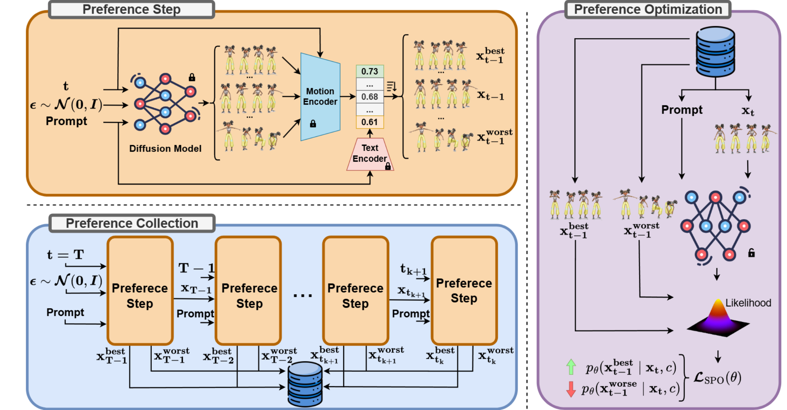

# DOPO: Dense Online Preference Optimization for Cross-Dataset Motion Diffusion Adaptation

[](https://miccunifi.github.io/DOPO/) []()

DOPO adapts a text-to-motion diffusion model (MDM) pretrained on a **source** dataset to generate motions that align with the distribution of a **target** dataset — without requiring paired data. It uses a DenseTMR evaluator trained on the target dataset as a dense reward signal during online preference optimization (SPO).



---

## Overview

The full pipeline consists of three stages:

1. **Pretrain MDM** — train a motion diffusion model on the source dataset.
2. **Train DenseTMR evaluator** — train a text–motion retrieval model on the *target* dataset. This model serves as the reward during DOPO fine-tuning.
3. **DOPO fine-tune (MDM-SPO)** — fine-tune the pretrained MDM on the target dataset distribution using online preference optimization guided by the DenseTMR reward.

Supported datasets: `humanml3d`, `kitml`, `babel`, `motionx`.

---

## Installation

```bash
conda create -n dopo python=3.10 -y
conda activate dopo

# PyTorch (CUDA 12.8)
pip install --pre torch torchvision --index-url https://download.pytorch.org/whl/nightly/cu128 --extra-index-url https://pypi.nvidia.com --no-deps

# Project dependencies
pip install -r requirements_clean.txt
pip install git+https://github.com/openai/CLIP.git
```

---

## Stage 1 — Pretrain a model

Train an MDM model from scratch on a source dataset using the SMPL-RiFKE motion representation (introducted in [link](https://arxiv.org/abs/2401.08559)).

```bash
# HumanML3D
python train_model.py \
    data=humanml3d \
    model=mdm \
    data.with_noise=false \
    data/motion_loader=smplrifke

# KiTML
python train_model.py \
    data=kitml \
    model=mdm \
    data.with_noise=false \
    data.text_to_token_emb=false \
    data.text_to_sent_emb=false

# BABEL
python train_model.py \
    data=babel \
    model=mdm \
    data.with_noise=false \
    data.text_to_token_emb=false \
    data.text_to_sent_emb=false

# MotionX
python train_model.py \
    data=motionx \
    model=mdm \
    data.with_noise=false \
    data.text_to_token_emb=false \
    data.text_to_sent_emb=false
```

Checkpoints are saved to `outputs/mdm_{dataset}_smplrifke/`.

Convenience scripts for all datasets: [bash/train_mdm_ALL_smplrifke.sh](bash/train_mdm_ALL_smplrifke.sh)

---

## Stage 2 — Train DenseTMR evaluator

Train a DenseTMR text–motion retrieval model on each **target** dataset. This evaluator is used both as a reward signal during DOPO fine-tuning and as the evaluation metric.

```bash
# HumanML3D
python train_evaluator.py \
    data=humanml3d \
    model=densetmr \
    data.with_noise=true \
    data.clip_embedder=false

# KiTML
python train_evaluator.py \
    data=kitml \
    model=densetmr \
    data.with_noise=true \
    data.clip_embedder=false

# BABEL
python train_evaluator.py \
    data=babel \
    model=densetmr \
    data.with_noise=true \
    data.clip_embedder=false

# MotionX
python train_evaluator.py \
    data=motionx \
    model=densetmr \
    data.with_noise=true \
    data.clip_embedder=false
```

Checkpoints are saved to `outputs/densetmr_{dataset}_smplrifke/`.

Convenience script: [bash/train_densetmr_ALL_smplrifke.sh](bash/train_densetmr_ALL_smplrifke.sh)

---

## Stage 3 — DOPO fine-tune (MDM-SPO)

Fine-tune a pretrained MDM on a target dataset using online preference optimization. The DenseTMR evaluator trained on the target dataset is used as the reward model.

Key arguments:
- `model.checkpoint_dir` — path to the pretrained **source** MDM checkpoint.
- `evaluator.checkpoint_dir` — path to the **target** DenseTMR evaluator checkpoint.
- `data` — target dataset.
- `run_dir` — output directory for the fine-tuned model.

### Example: HumanML3D → KiTML

```bash
python train_model_spo.py \
    data=kitml \
    model=mdm_spo \
    data.with_noise=false \
    data.text_to_token_emb=false \
    data.text_to_sent_emb=false \
    dataloader.batch_size=160 \
    model.train_batch_size=160 \
    model.lr=1e-7 \
    model.ckpt="last" \
    evaluator.checkpoint_dir='outputs/densetmr_kitml_smplrifke' \
    model.checkpoint_dir='outputs/mdm_humanml3d_smplrifke' \
    run_dir='outputs/mdmspo_humanml3d_to_kitml_smplrifke_lr1e-7' \
    trainer.max_epochs=20 \
    group_name='H2K'
```

### Example: BABEL → all targets

```bash
bash bash/train_mdmspo_babel_2_ALL.sh
```

Convenience scripts for all source→target pairs are in [bash/](bash/).

---

## Evaluation

### Evaluate baseline MDM (before fine-tuning)

```bash
python eval_model.py \
    model=mdm \
    evaluator=densetmr \
    data=kitml \
    model_checkpoint_dir='outputs/mdm_humanml3d_smplrifke' \
    evaluator_checkpoint_dir='outputs/densetmr_kitml_smplrifke' \
    data.clip_embedder=false \
    data.text_to_token_emb=false \
    data.text_to_sent_emb=false \
    distance_metric='cosine' \
    model_ckpt="last" \
    output_dir='evaluation_results/mdm_humanml3d_on_kitml'
```

All cross-dataset baselines: [bash/eval_mdm_baselines_ALL.sh](bash/eval_mdm_baselines_ALL.sh)

### Evaluate fine-tuned MDM-SPO (best checkpoint)

```bash
python eval_model.py \
    model=mdm_spo \
    evaluator=densetmr \
    data=kitml \
    model_checkpoint_dir='outputs/mdmspo_humanml3d_to_kitml_smplrifke_lr1e-7' \
    evaluator_checkpoint_dir='outputs/densetmr_kitml_smplrifke' \
    data.clip_embedder=false \
    data.text_to_token_emb=false \
    data.text_to_sent_emb=false \
    distance_metric='cosine' \
    model_ckpt="best" \
    output_dir='evaluation_results/mdmspo_humanml3d_to_kitml_best'
```

All fine-tuned models: [bash/eval_mdmspo_best_ALL.sh](bash/eval_mdmspo_best_ALL.sh)

Reported metrics: R@1/R@3/R@10, MedR (T2M and M2T), FID, diversity, multimodality. Results are saved to `evaluation_results/*/results.json`.

---

## Project Structure

```
├── train_model.py          # Stage 1: pretrain MDM
├── train_evaluator.py      # Stage 2: train DenseTMR evaluator
├── train_model_spo.py      # Stage 3: DOPO fine-tuning
├── eval_model.py           # Evaluation script
├── configs/                # Hydra configs (data, model, trainer)
│   ├── DenseTMR/
│   ├── MDM_SPO/
│   └── ...
├── models/                 # Model implementations
├── evaluators/             # Evaluator implementations (TMR, DenseTMR, Guo)
├── bash/                   # Convenience training/evaluation scripts
└── outputs/                # Saved checkpoints (created at runtime)
```

---

## TODO

- [ ] Add StableMoFusion support as a generative backbone
- [ ] Add support for additional datasets
- [ ] Add arXiv link
- [ ] Release checkpoints for pretrained models
- [ ] Release checkpoints for trained evaluators
- [ ] Release checkpoints for fine-tuned models

---

## License

This work is licensed under a [Creative Commons Attribution-ShareAlike 4.0 International License](http://creativecommons.org/licenses/by-sa/4.0/).
